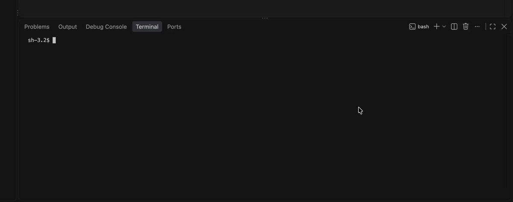

# vsterm

Open/Close VS Code terminals from the command line.



## Usage

```sh
vsterm open -n api -- npm run dev
```

| Flag                  |                                                                 |
| --------------------- | --------------------------------------------------------------- |
| `-n, --name`          | terminal name (required); reusing a name restarts that terminal |
| `-g, --group`         | split next to other terminals in the same group                 |
| `--color`             | black, red, green, yellow, blue, magenta, cyan, white           |
| `-e, --env KEY=VALUE` | extra environment variable (repeatable)                         |
| `--cwd`               | working directory (default: current)                            |
| `--focus`             | switch to the new terminal                                      |

```sh
vsterm close --all
```

| Flag          |                                                   |
| ------------- | ------------------------------------------------- |
| `NAME...`     | close these terminals                             |
| `-g, --group` | close every terminal in this group                |
| `--all`       | close every terminal opened by vsterm             |
| `-f, --force` | close immediately instead of sending Ctrl+C first |
| `--timeout`   | how long to wait after Ctrl+C (default 5s)        |
